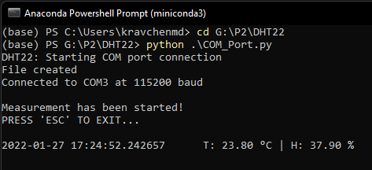
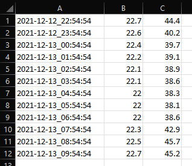

# DHT22_COM

Arduino firmware and Python script for reading data of the temperature-humidity sensor [DHT-22](https://www.waveshare.com/DHT22-Temperature-Humidity-Sensor.htm) from Arduino.
Arduino connection (signal line is connected to aт arbitrary pin, it can be changed in the firmware code):
*Note: the sensor can be powered either with 5 and 3.3 V*
 - Arduino Uno

 - Arduino Nano
 

## Requirements

In order to program Arduino board the Arduino IDE should be installed. Then the DHT22 library should be installed inside the IDE. For this:

 1. Click Sketch -> Include library -> Manage libraries (or *Ctrl + Shift + J*)
 2. Type "DHT22" in the Filter your search field and click Install button (last version):
 
 
 In order to run Python script, the latest version on Python and Anaconda/Miniconda should be installed as well. Miniconda is preferable, since the smaller size.
 For this just downwload Miniconda from the official webcite [here](https://docs.conda.io/en/latest/miniconda.html) (also it will contain latest version of Python).
 
 After installation you'll be able to run Anaconda prompt. I reccomend to use Anaconda Powershell Prompt.
 
 In order to exclude some issues with interrupting the script run with the mouse click, find Anaconda Powershell Prompt, click with right button and choose Open file location. Then click on the shortcut with right button and choose Properties. Then choose Option section and leave only these options (at least uncheck Quick Edit Mode and Insert mode):

 Also, it's usefull to change the default path when Anaconda Powershell Prompt is opened. For this just go to the Shortcut section in Properties and change "Start in" field (by default contais %HOMEPATH%).

Now everything is ready for the Arduino firmwhare uploading and rinning the Python script.
 
## Parameters and options

### Arduino
The data signal pin can be choosen here in the Arduino firmware code:
`#define DHTPIN 2     // what digital pin we're connected to`
Arduino is connected to the PC via COM-poert with baudrate of 115200.

### Python script
In order to run the Python script, you need to connect Arduino and find the right COM port (in devices manager) and, if needed, change it manually in the DHT22_COM.py in the following code section:

    # Important variables
    comPort = "COM3"
    baudRate = 115200
    samp_per = 60  # in mimuntes

Also, here you can chande the sampling perion, which is in minutes.

Then you can just type the following command in the Anaconda Powershell Prompt (*it the directory, where the script is located*):
`python DHT22_COM.py`
After that the script will start running. There is an example of output in the prompt bellow:

*Note: if there are any messages about missing libraries, use command like this to install needed libraries/packages (but Miniconda should have all needed libraries by default)*
`conda install -c anaconda pyserial time`

Also, the script will save all results in the .csv file with name `Year-Month-Day_Hour-Minutes-Seconds.csv`. The example of the file content is bellow:

